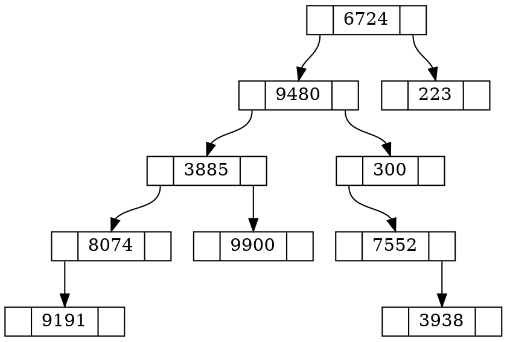
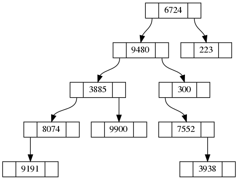

# Simple Random Binary Tree Generator

This repo implements a very simple random binary tree generator. The major purpose of this repo is to produce some test cases for binary-tree related problems on leetcode.


## Usage 

see ["example.cpp"](./example.cpp)

## Sample Output

> By `SimplePrint`:
```text
{val : 6724, left : 9480, right : 223}
{val : 9480, left : 3885, right : 300}
{val : 3885, left : 8074, right : 9900}
{val : 8074, left : 9191, right : NULL}
{val : 9191, left : NULL, right : NULL}
{val : 9900, left : NULL, right : NULL}
{val : 300, left : 7552, right : NULL}
{val : 7552, left : NULL, right : 3938}
{val : 3938, left : NULL, right : NULL}
{val : 223, left : NULL, right : NULL}
```

> By `TreeToDot`:


Note that the dot file can be viewed visualized with `xdot` or you can use `graphviz` to get the PNG by simple running `dot -Tpng -o example.png bt.dot`.
The resulted PNG is shown below.
    
